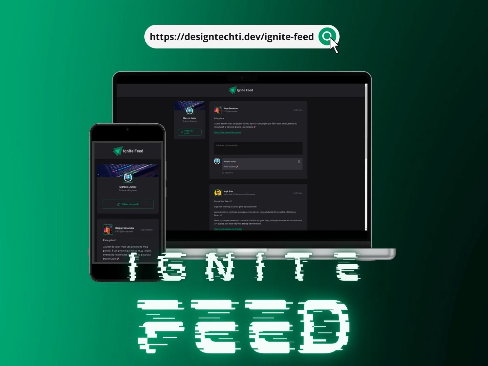

<div style="text-align: center;">
    
</div>

<br>

---

<div style="text-align: center;">
  <a href="#memo-project">Project</a>&nbsp;&nbsp;&nbsp;|&nbsp;&nbsp;&nbsp;
  <a href="#rocket-technologies">Technologies</a>&nbsp;&nbsp;&nbsp;|&nbsp;&nbsp;&nbsp;
  <a href="#clipboard-requirements">Requirements</a>&nbsp;&nbsp;&nbsp;|&nbsp;&nbsp;&nbsp;
  <a href="#keyboard-how-to-run-the-project">How to run the project </a>&nbsp;&nbsp;&nbsp;|&nbsp;&nbsp;&nbsp;
    <a href="#art-layout">Layout</a>&nbsp;&nbsp;&nbsp;|&nbsp;&nbsp;&nbsp;
</div>

<br>

## :rocket: Technologies

This project was developed using the following technologies:

- [React](https://pt-br.reactjs.org/)
- [Vite](https://vitejs.dev/)
- [TypeScript](https://www.typescriptlang.org/)
- [CSSModules](https://github.com/css-modules/css-modules)
- [Phosphor](https://phosphoricons.com/)
    <br>

---

## :memo: Project

**Ignite Feed**

Ignite Feed is a social network-like project that allows users to create posts and receive comments and likes from their friends. Built with cutting-edge technologies, this project provides a seamless user experience and showcases the power of modern web development. :star_struck:

Features:

- Create and share posts with your network.
- Receive comments and likes on your posts from friends.
- Responsiveness ensures a seamless experience across various devices.
- Personalize the user interface with custom color themes.

This is a project developed during React bootcamp **[Ignite](https://www.rocketseat.com.br/discover)**, run by **[@Rocketseat](https://github.com/Rocketseat)**

<br>

## :clipboard: Requirements

Before starting you need :checkered_flag:, have installed the [Git](https://git-scm.com) and [Node](https://nodejs.org/en/).

<br>

---

## :keyboard: How to run the project

```bash
# Clone this project
$ git clone git@github.com:designtechti490/ignite_feed.git

# path
$ cd ignite-feed-ts

# Install dependencies
$ npm i

# Run the project
$ npm run dev

# The server will initialize in the <http://localhost:5173/>
```

<br>

---

## :art: Layout

You can visualize the project layout through the links below:
I created my version of colors and responsiveness. Feel free to duplicate and unleash your creativity.

- [Ignite Feed](<https://www.figma.com/file/XnV9d4Nw9DhzphZNxEH9OD/Ignite-Feed-(Community)?node-id=0%3A1>)

Remembering that you need to have a [Figma](http://figma.com/) para acessá-lo.

---

## Deployment

<https://codesandbox.io/p/github/designtechti490/ignite-feed/main>

<a href="#top">☝</a>

<p style="text-align: center;">Developed with 💙 by Marcelo Junior</p>
